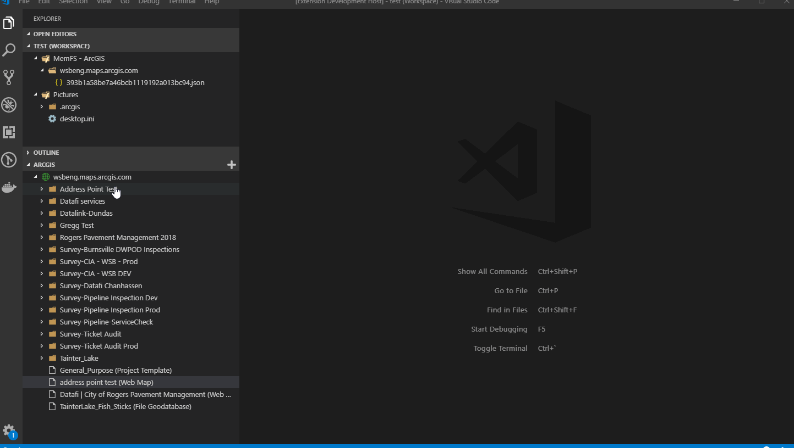

# arcgis-assistant README

This is a highly experimental plugin for editing ArcGIS Portal and Online items in VS Code. Use at your own risk!

## Features

 - Browse ArcGIS Online's folder hierarchy using a tree view built into VS Code.
 - Copy Item and Folder ID's to the clipboard
 - Edit raw JSON from item data in Visual Studio Code

## Requirements

1. VS Code
2. Open workspace with read/write permissions

In order to perform editing, VSCode will download a copy of the ArcGIS Item JSOn to a local directory.

## Download

See the [Releases Page](https://github.com/roemhildtg/vscode-arcgis-assistant/releases) for downloads.

## Installing

When you download the vsix file from the releases page, it can be installed by using the Extensions toolbar. See [Installing vsix files](https://code.visualstudio.com/docs/editor/extension-gallery#_install-from-a-vsix)

## Known Issues

## Release Notes

### 0.0.1

Initial release with support for editing AGO/Portal document items.

## Future Considerations

 - Copy paste items (within and between portals)
 - Create new items 
 - Preview maps and layers in vscode web view