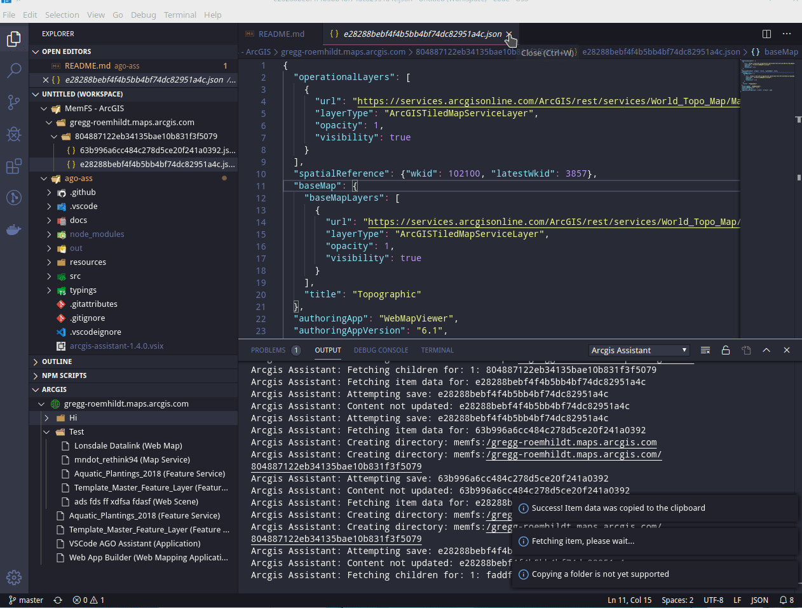

# arcgis-assistant README

This is a highly experimental plugin for editing ArcGIS Portal and Online items in VS Code. Use at your own risk!



## Current Features

 - Browse Portal/AGO folder hierarchy using a tree view built into VS Code.
 - Edit JSON data from items directly in VS Code
 - Delete items
 - Copy/Paste items between portal/AGO accounts

## Future enhancements/bugs:

See [issues/enhancements](https://github.com/roemhildtg/vscode-arcgis-assistant/issues)

Please upvote important issues using the :thumbsup: button. 

## Requirements

1. VS Code
2. Open workspace with read/write permissions

In order to perform editing, VSCode will download a copy of the ArcGIS Item JSOn to a local directory.

## Download

See the [Releases Page](https://github.com/roemhildtg/vscode-arcgis-assistant/releases) for downloads.

## Installing and Usage

When you download the vsix file from the releases page, it can be installed by using the Extensions toolbar. See [Installing vsix files](https://code.visualstudio.com/docs/editor/extension-gallery#_install-from-a-vsix)

Now when you open up vscode, you should see an ArcGIS pane in the explorer tab. (It will be towards the bottom). Hovering over this, will allow you to add a portal. You can also use the command `addPortal`. This will
add the portal to the tree. You will be prompted to log in once you access the tree data, if your url is correct.

Editing items can be done by clicking the item. If you double click it again, after its been opened, VSCode will automatically format the `json` document.

After saving, the item will automatically upload to AGO. 

## Known Issues

 - If you try to log in to two portals/ago accounts at once, it will hang the extension. This is explained in [#15](https://github.com/roemhildtg/vscode-arcgis-assistant/issues/15). To workaround this, only log in to one portal at a time.
 - Copy/Paste may not work correctly on Windows. If someone has a Windows host to test with and diagnose, pull requests to fix will be accepted. 

## Developing

This projet uses vs code for development and must be installed prior to starting. 

```
git clone <this repo>
npm i

```

Run the VSC debugger tool.

## Building for production

Due to a bug in `copy-paste` before building to production, `copy-paste/index.js` must be modified to

```javascript
	case "openbsd":
        config = require("./platform/linux");
```

## Known Issues
 - Copy/Paste doesn't work: See [node-copy-paste](https://www.npmjs.com/package/copy-paste)

## Release Notes

See the [releases page](https://github.com/roemhildtg/vscode-arcgis-assistant/releases)

